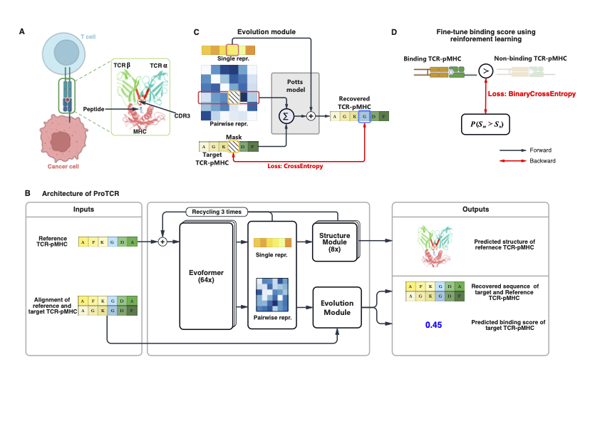

# ProTCR


[](https://conventionalcommits.org)


This package provides an implementation of the inference pipeline of [ProTCR](https://github.com/bigict/tcr_pmhc). 

## Requirements

* [Python3.8+](https://www.python.org)
* [ProFOLD2](https://github.com/bigict/ProFOLD2)
* [Dependencies](https://github.com/bigict/tcr_pmhc/network/dependencies)

## Installation

1.  Clone this repository and `cd` into it.

  ```bash
  $git clone https://github.com/bigict/tcr_pmhc.git
  $cd tcr_pmhc
  $git submodule update --init --remote
  ```

2. Create conda an environment and activate it.

  ```bash
  $conda create -n tcr python=3.11
  $conda acrivate tcr
  ```

  You need to install the [ProFOLD2](https://github.com/bigict/ProFOLD2) dependencies
  ```bash
  bash profold2/install_env.sh
  ```

  And then
  ```
  pip install -r requirements.txt 
  ```

## Running ProTCR

1. Inference

  ```bash
  ./predict.sh --output_dir [OUTPUT_DIR] --model {fold0, fold1, fold2, fold3, fold4} [CSV_FILE]...
  ```
  
  You can run
  ```bash
  $predict.sh --help
  ```
  for further help.
  
2. Train

  Create the 5-fold dataset first
  ```bash
  bash data/train_data_fold_5.sh
  ```

  ProTCR was fine-tuned from [ProFOLD2](https://github.com/bigict/ProFOLD2) by Reinforcement Learning.
  Please follow the instruction to train [ProFOLD2](https://github.com/bigict/ProFOLD2)
